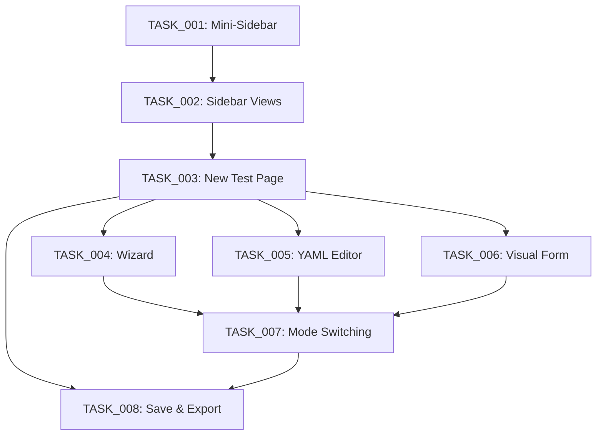

# 🎯 Roadmap: Sistema de Criação de Test Suites

## 📋 Visão Geral

Este roadmap documenta o planejamento completo para implementar o sistema de criação de Test Suites para o Flow Test Web, incluindo refatoração do sidebar e 3 modos de criação (Wizard, YAML Editor, Visual Form).

---

## 🗺️ Estrutura de Tasks

### **FASE 1: Refatoração do Sidebar** (TASK_001 → TASK_002)

#### TASK_001: Refatorar Sidebar - Mini-Sidebar Persistente
- **Status:** 🔴 To Do
- **Prioridade:** P0 (Crítica)
- **Estimativa:** 4 horas
- **Objetivo:** Transformar sidebar em mini-sidebar inspirado no VS Code (60px ícones + área de conteúdo)
- **Entregas:**
  - MiniSidebar com ícones fixos (Collections, Environments, History, Settings)
  - Remoção do header do sidebar
  - Área de conteúdo resize-able (280-600px)
  - Drag handle funcional

#### TASK_002: Sistema de Navegação do Sidebar com Views Dinâmicas
- **Status:** 🔴 To Do
- **Prioridade:** P0 (Crítica)
- **Estimativa:** 3 horas
- **Bloqueada por:** TASK_001
- **Objetivo:** Implementar sistema de views dinâmicas para alternar conteúdo do sidebar
- **Entregas:**
  - Views Registry (lazy loading)
  - CollectionsView, EnvironmentsView, HistoryView, SettingsView
  - Redux slice para gerenciar estado
  - Preservação de estado ao alternar views

---

### **FASE 2: Página de Criação de Test Suites** (TASK_003)

#### TASK_003: Criar Página 'New Test Suite'
- **Status:** 🔴 To Do
- **Prioridade:** P0 (Crítica)
- **Estimativa:** 3 horas
- **Bloqueada por:** TASK_002
- **Objetivo:** Criar página dedicada `/new-test` com layout two-panel
- **Entregas:**
  - Rota `/new-test` configurada
  - Header com mode selector (Wizard/YAML/Form)
  - Layout two-panel (editor + preview YAML)
  - Redux slice para gerenciar estado do editor

---

### **FASE 3: Modos de Criação** (TASK_004 → TASK_006)

#### TASK_004: Implementar Wizard Multi-Step
- **Status:** 🔴 To Do
- **Prioridade:** P1 (Alta)
- **Estimativa:** 6 horas
- **Bloqueada por:** TASK_003
- **Objetivo:** Wizard guiado em 5 steps para criar Test Suite
- **Entregas:**
  - Step 1: Basic Info (suite_name, node_id, description)
  - Step 2: Configuration (base_url, execution_mode, variables, metadata)
  - Step 3: Steps Builder (add/edit/remove test steps)
  - Step 4: Assertions & Capture
  - Step 5: Review & Generate

#### TASK_005: Editor YAML com Autocomplete
- **Status:** 🔴 To Do
- **Prioridade:** P1 (Alta)
- **Estimativa:** 4 horas
- **Bloqueada por:** TASK_003
- **Objetivo:** Monaco Editor com schema validation e autocomplete
- **Entregas:**
  - Monaco Editor integrado com YAML syntax
  - Schema validation em tempo real
  - Autocomplete baseado no flow-test-engine.schema.json
  - Snippets para estruturas comuns
  - Hover tooltips com documentação

#### TASK_006: Formulário Visual
- **Status:** 🔴 To Do
- **Prioridade:** P2 (Média)
- **Estimativa:** 5 horas
- **Bloqueada por:** TASK_003
- **Objetivo:** Formulário visual completo que gera YAML automaticamente
- **Entregas:**
  - Schema-driven form generator
  - Campos dinâmicos para todas as propriedades
  - Validação em tempo real
  - Preview YAML sincronizado

---

### **FASE 4: Integração e Salvamento** (TASK_007 → TASK_008)

#### TASK_007: Sistema de Alternância entre Modos
- **Status:** 🔴 To Do
- **Prioridade:** P1 (Alta)
- **Estimativa:** 3 horas
- **Bloqueada por:** TASK_004, TASK_005, TASK_006
- **Objetivo:** Sincronização de dados entre Wizard ↔ YAML ↔ Form
- **Entregas:**
  - Conversores bidirecionais (wizardToYAML, yamlToWizard, etc)
  - Auto-save local (localStorage)
  - Restore de draft ao recarregar página
  - Warnings de perda de dados ao alternar

#### TASK_008: Salvamento e Exportação
- **Status:** 🔴 To Do
- **Prioridade:** P1 (Alta)
- **Estimativa:** 3 horas
- **Bloqueada por:** TASK_003, TASK_007
- **Objetivo:** Integrar salvamento via Electron IPC e exportação de YAML
- **Entregas:**
  - Save Test Suite (Electron dialog)
  - Export YAML (download no browser)
  - Add to Collection (modal de seleção)
  - Validação antes de salvar
  - Feedback visual (loading, success, error)

---

## 📊 Resumo de Estimativas

| Fase | Tasks | Tempo Total | Prioridade |
|------|-------|-------------|------------|
| **FASE 1: Sidebar** | 2 tasks | **7 horas** | P0 (Crítica) |
| **FASE 2: Página** | 1 task | **3 horas** | P0 (Crítica) |
| **FASE 3: Modos de Criação** | 3 tasks | **15 horas** | P1/P2 |
| **FASE 4: Integração** | 2 tasks | **6 horas** | P1 |
| **TOTAL** | **8 tasks** | **31 horas** | - |

---

## 🔄 Dependências entre Tasks

---

## 🎯 Ordem de Execução Recomendada

1. **TASK_001** - Refatorar Sidebar (fundação do layout)
2. **TASK_002** - Sidebar Views (navegação funcional)
3. **TASK_003** - New Test Page (base para criação)
4. **TASK_005** - YAML Editor (modo mais direto, menor complexidade)
5. **TASK_004** - Wizard (modo guiado, maior complexidade)
6. **TASK_006** - Visual Form (último modo)
7. **TASK_007** - Mode Switching (integração entre modos)
8. **TASK_008** - Save & Export (finalização)

---

## 📚 Recursos e Referências

### Documentação
- **Schema JSON:** `public/flow-test-engine.schema.json`
- **Copilot Instructions:** `.github/copilot-instructions.md`
- **Task Manager Guide:** `docs/task-manager.chatmode.md`

### Bibliotecas Principais
- **Monaco Editor:** `@monaco-editor/react`, `monaco-yaml`
- **Form Management:** `react-hook-form`, `yup` ou `zod`
- **YAML:** `js-yaml`
- **Icons:** `react-icons` ou `lucide-react`
- **Redux:** `@reduxjs/toolkit` (já instalado)

### Design Inspiration
- **VS Code Sidebar:** Layout mini-sidebar + content area
- **Postman:** Estrutura de collections e requests
- **Bruno:** YAML-first approach

---

## 🚀 Próximos Passos

### Imediatos (Sprint Atual)
1. ✅ Planejar todas as tasks (CONCLUÍDO)
2. 🔄 Iniciar TASK_001 (Refatoração do Sidebar)
3. 🔄 Code review e ajustes de design

### Curto Prazo (Próxima Sprint)
- Implementar TASK_002 a TASK_004
- Testes de integração
- Documentação de uso

### Médio Prazo
- TASK_005 a TASK_008
- Polimento de UX
- Testes end-to-end

---

## 📝 Notas Gerais

### Decisões Arquiteturais
- **Redux** para estado global (sidebar views, editor state)
- **Electron IPC** para operações de arquivo
- **Schema-driven** forms e validation
- **Three-mode approach:** Wizard (beginners) → YAML (power users) → Form (visual preference)

### Riscos Identificados
1. **Complexidade do Wizard:** Step 3 (Steps Builder) é muito complexo - dividir em sub-componentes
2. **Schema Validation:** Garantir que validação seja robusta e informativa
3. **Sincronização entre Modos:** Conversão YAML ↔ Data pode ter perda de informação - documentar limitações

### Melhorias Futuras
- [ ] Templates de test suites pré-configurados
- [ ] AI assistant para gerar steps baseado em descrição
- [ ] Importação de Postman/Bruno collections
- [ ] Collaborative editing (múltiplos usuários)
- [ ] Version control integration (Git)

---

**Data de Criação:** 2025-10-25
**Última Atualização:** 2025-10-25
**Responsável:** @marcuspmd
**Status Geral:** 🔴 Planejamento Completo - Aguardando Início de Implementação
